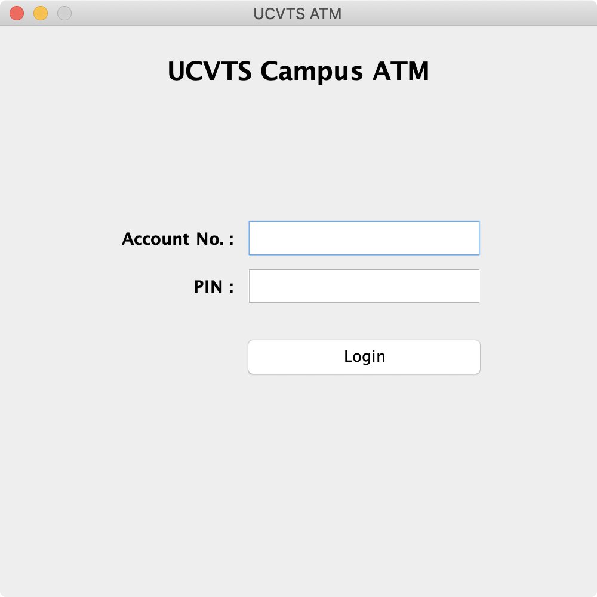
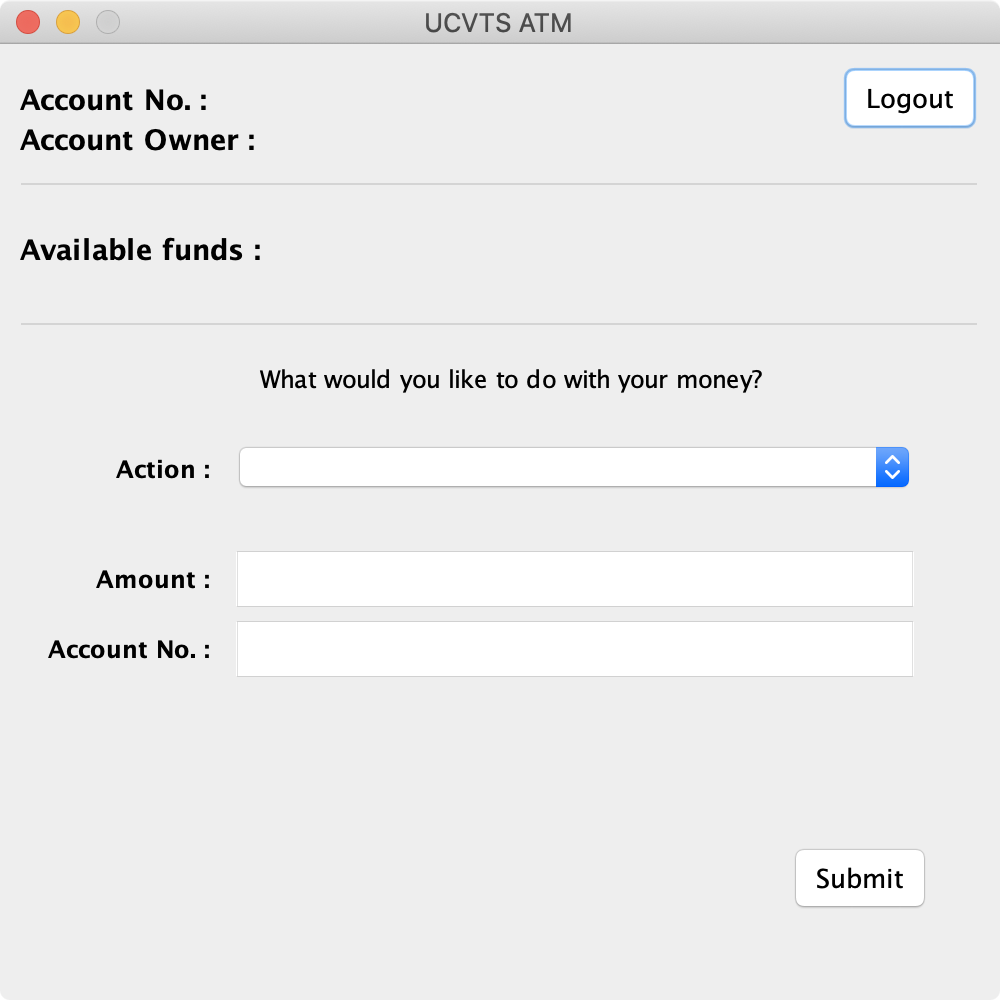

# Tutorial 1

## Summary

In our first tutorial, we're going to build a functioning ATM application. And yes, this will be a graphical application. No, you're not done with Swing just yet.

Users will be allowed to login to their accounts, view their balance, as well as deposit, withdraw, or transfer funds. Don't worry, we're going to walkthrough it together before I turn you loose on your own.

## Model

Let's start with the model. Remember, applications are all about data. What entities will we need to model for an ATM application? If we zoom all the way out, there's really only two.

* Users
* Bank accounts

As we start to design our application, these entities will become the primary classes of our program. In the real world, we'd likely track much more than we're going to in this tutorial. This is more to get the feel of how to build an application from scratch.

### Users

Let's start with the `User` class.

* First name
* Last name
* Email address
* Phone number
* Bank account

That's good for now. To keep things simple, we'll pretend that users only have one bank account.


```java
package org.ucvts.model;

public class User {

    private String firstName;
    private String lastName;
    private String emailAddress;
    private long phoneNumber;
    private BankAccount account;

    /**
     * Create a new User with a default BankAccount.
     * 
     * @param firstName
     * @param lastName
     * @param emailAddress
     * @param phoneNumber
     */

    public User(String firstName, String lastName, String emailAddress, long phoneNumber) {
        this.firstName = firstName;
        this.lastName = lastName;
        this.emailAddress = emailAddress;
        this.phoneNumber = phoneNumber;

        this.account = new BankAccount();
    }

    public String getFirstName() {
        return firstName;
    }

    public String getLastName() {
        return lastName;
    }

    public String getEmailAddress() {
        return emailAddress;
    }

    public long getPhoneNumber() {
        return phoneNumber;
    }

    public BankAccount getAccount() {
        return account;
    }
}

```


Pretty straightforward, right? The `User` class doesn't do a whole lot. We'll call upon it to provide us with data, but the business logic is going to live in the `BankAccount` class.

### Bank Accounts

Let's put those pieces in place.

* Account number
* Balance

Sure, there are almost certainly more things that a real bank account would track, but this is good for the purposes of this tutorial.


```java
package org.ucvts.model;

import java.math.BigDecimal;

import org.ucvts.ATM;

public class BankAccount {

    private static long nextAccountNumber = 10000001L;

    private long accountNumber;
    private BigDecimal balance;

    /**
     * Creates a BankAccount with the next available account number, and a starting
     * balance of 0.00.
     */

    public BankAccount() {
        this.accountNumber = BankAccount.nextAccountNumber++;
        this.balance = new BigDecimal(0);
    }

    public long getAccountNumber() {
        return accountNumber;
    }

    public BigDecimal getBalance() {
        return balance;
    }
}

```


We're doing some different things here that you may not have seen before, so let's take the time to slow down and wrap our heads around it. First, the `accountNumber` and `nextAccountNumber`. What are these and why do we need both?

`accountNumber` is going to represent the account number of each user's account. It will be unique. `nextAccountNumber` is static, and therefore all instances of the `BankAccount` class share its value. Changing it from one class changes it for all classes. This allows us to use it to keep the next available account number queued up. Whenever we create a new account, we assign it this `nextAccountNumber` value before incrementing it by one.

And what about `BigDecimal`? Well, that's a built-in class designed for currencies \(or really whenever exact precision is needed\). As I'm sure you've seen in some of the Java problem sets, sometimes a `double` has weird rounding errors. This isn't acceptable in financial applications, so we use something that isn't plagued with those problems.

I said the business logic would be handled by the BankAccount class, so let's add that in now. We need to be able to deposit, withdraw, and transfer funds. Deposits and withdrawals are easy, since we just need to update the balance. Transfers will require another bank account. We'll layout the broad strokes, but we'll need to come back later to finish the job.


```java
package org.ucvts.model;

import java.math.BigDecimal;

import org.ucvts.ATM;

public class BankAccount {

    private static long nextAccountNumber = 10000001L;

    private long accountNumber;
    private BigDecimal balance;

    /**
     * Creates a BankAccount with the next available account number, and a starting
     * balance of 0.00.
     */

    public BankAccount() {
        this.accountNumber = BankAccount.nextAccountNumber++;
        this.balance = new BigDecimal(0);
    }

    public long getAccountNumber() {
        return accountNumber;
    }

    public BigDecimal getBalance() {
        return balance;
    }

    /**
     * Deposits funds into this account.
     * 
     * @param amount - the amount to deposit
     * @return a status code indicating the result of the deposit
     */

    public int deposit(BigDecimal amount) {
        if (amount.compareTo(BigDecimal.ZERO) <= 0) {
            return ATM.INVALID;
        } else {
            balance = balance.add(amount);
        }

        return ATM.SUCCESS;
    }

    /**
     * Withdraws funds from this account.
     * 
     * @param amount - the amount to withdraw
     * @return a status code indicating the result of the withdrawal
     */

    public int withdraw(BigDecimal amount) {
        if (amount.compareTo(BigDecimal.ZERO) <= 0) {
            return ATM.INVALID;
        } else {
            if (balance.subtract(amount).compareTo(BigDecimal.ZERO) < 0) {
                return ATM.INSUFFICIENT;
            } else {
                balance = balance.subtract(amount);
            }
        }

        return ATM.SUCCESS;
    }

    /**
     * Transfers funds from this account to another account.
     * 
     * @param destination - the destination account
     * @param amount      - the amount to transfer
     * @return a status code indicating the result of the transfer
     */

    public int transfer(BankAccount destination, BigDecimal amount) {
        int status = this.withdraw(amount);

        if (status == ATM.SUCCESS) {
            return destination.deposit(amount);
        } else {
            return status;
        }
    }
}

```


If you're following along, which you should be, your code won't compile just yet. Don't worry, we'll get to that. First, let's make sure we understand the three methods we just added to the `BankAccount` class.

* **`deposit`**

The `deposit` method performs an obvious job. It puts money into the account.

```java
/**
  * Deposits funds into this account.
  * 
  * @param amount - the amount to deposit
  * @return a status code indicating the result of the deposit
  */

public int deposit(BigDecimal amount) {
    if (amount.compareTo(BigDecimal.ZERO) <= 0) {
        return ATM.INVALID;
    } else {
        balance = balance.add(amount);
    }
    
    return ATM.SUCCESS;
}
```

First, we need to check that the `amount` we're trying to deposit is valid. We don't want to accept negative numbers or zero, which is what the `if` statement verifies. If the `amount` is less than or equal to zero, we return a status code indicating that the amount wasn't valid. You'll see where those are defined next.

If the `amount` is valid, then we update the `balance` using the `add` method from the `BigDecimal` class. Afterwards, we return a success status code.

* **`withdraw`**

Like the `deposit` method, the `withdraw` method is equally intuitive. It takes money out of the account.

```java
/**
  * Withdraws funds from this account.
  * 
  * @param amount - the amount to withdraw
  * @return a status code indicating the result of the withdrawal
  */

public int withdraw(BigDecimal amount) {
    if (amount.compareTo(BigDecimal.ZERO) <= 0) {
        return ATM.INVALID;
    } else {
        if (balance.subtract(amount).compareTo(BigDecimal.ZERO) < 0) {
            return ATM.INSUFFICIENT;
        } else {
            balance = balance.subtract(amount);
        }
    }
        
    return ATM.SUCCESS;
}
```

We need to do the same check as the `deposit` method. The `amount` has to be a positive, non-zero value, otherwise we return an invalid status code.

Unique to the withdraw method, we also need to verify that we have enough money in the account to perform the transaction. Here's how we're doing that.

The `BigDecimal` methods \(e.g., `add` or `subtract`\) don't actually modify the calling object unless we explicitly set the return value to the caller. To clarify, the following line will tell us what the result of the transaction will be without actually modifying `balance`.

```java
if (balance.subtract(amount).compareTo(BigDecimal.ZERO) < 0) {
    return ATM.INSUFFICIENT;
}
```

So, if the `if` statement is `true` and the result of the transaction would be a negative `balance`, then we know we don't have enough money and should return an insufficient funds status code. Otherwise, we're free to actually modify the `balance`. We use the same call to the `subtract` method in the `BigDecimal` class, except we set `balance` equal to the return value to capture the change.

* **`transfer`**

While we'll need to come back to this method a bit later to verify the existence of the `destination` account, the functionality of transferring boils down to simply withdrawing from one account and depositing into another. We can reuse the methods we already have in place.

```java
/**
  * Transfers funds from this account to another account.
  * 
  * @param destination - the destination account
  * @param amount - the amount to transfer
  * @return a status code indicating the result of the transfer
  */

public int transfer(BankAccount destination, BigDecimal amount) {        
    int status = this.withdraw(amount);
    
    if (status == ATM.SUCCESS) {
        return destination.deposit(amount);
    } else {
        return status;
    }
}
```

First, we want to withdraw from the original account, which is `this` account. We capture the status code from the return value of the `withdraw` method. If we were able to successfully perform the withdrawal, we proceed with depositing the funds into the `destination` account.

If you're paying attention, you'll see that I used `this.withdraw` and `destination.deposit`. Using `this` wasn't necessary, but it clarifies that I am withdrawing money from the current account. Using `destination` when calling deposit is required, otherwise the money wouldn't go to the right place.

All of the verifications against amount are handled by the `deposit` and `withdraw` methods. Later, we'll come back and add a check that the `destination` account actually exists.

But what about all these references to `ATM`? That's a class, and for now it isn't going to have much in it except the status codes we've been using.


```java
package org.ucvts;

public class ATM {

    public static final int SUCCESS = 0;
    public static final int INVALID = 1;
    public static final int INSUFFICIENT = 2;
}

```


This should resolve some of the compilation errors I'm sure you were getting. We'll expand upon this in the next section as we build our views.

## View

Alright, on to the view. We're keeping thing simple, so we'll only have a couple of views to manage.

* Login view
* Transaction view

The login view, of course, is where users will login to the ATM using their account numbers and PINs. The transaction view is where, once logged in, users can view their balance, deposit or withdraw funds, or transfer money to another account.

### Login

Let's start with the login view.


```java
package org.ucvts.view;

import java.awt.Color;
import java.awt.Font;
import java.awt.event.ActionEvent;
import java.awt.event.ActionListener;
import java.awt.event.KeyAdapter;
import java.awt.event.KeyEvent;

import javax.swing.JButton;
import javax.swing.JLabel;
import javax.swing.JPanel;
import javax.swing.JPasswordField;
import javax.swing.JTextField;
import javax.swing.SwingConstants;

@SuppressWarnings("serial")
public class LoginView extends JPanel {

    private JTextField accountField;
    private JPasswordField pinField;
    private JButton loginButton;
    private JLabel errorMessageLabel;

    public LoginView() {
        super();

        this.init();
    }

    public JTextField getAccountField() {
        return accountField;
    }

    public JPasswordField getPinField() {
        return pinField;
    }

    /*
     * Shows or hides the error message.
     * 
     * @param show - true to show, false to hide
     */

    public void toggleErrorMessage(boolean show) {
        if (show) {
            errorMessageLabel.setText("Invalid account number and/or PIN.");
        } else {
            errorMessageLabel.setText("");
        }
    }

    /*
     * Clears the account and PIN fields, and hides the error message.
     */

    public void clear() {
        accountField.setText("");
        pinField.setText("");

        toggleErrorMessage(false);
    }

    /*
     * Initializes all components of this view.
     */

    private void init() {
        this.setLayout(null);

        initTitle();
        initErrorMessageLabel();
        initAccountField();
        initPinField();
        initLoginButton();
    }

    private void initTitle() {
        JLabel label = new JLabel("UCVTS Campus ATM", SwingConstants.CENTER);
        label.setBounds(0, 20, 500, 35);
        label.setFont(new Font("DialogInput", Font.BOLD, 21));

        this.add(label);
    }

    private void initErrorMessageLabel() {
        errorMessageLabel = new JLabel("", SwingConstants.CENTER);
        errorMessageLabel.setBounds(0, 110, 500, 35);
        errorMessageLabel.setFont(new Font("DialogInput", Font.ITALIC, 12));
        errorMessageLabel.setForeground(Color.RED);

        this.add(errorMessageLabel);
    }

    private void initAccountField() {
        JLabel label = new JLabel("Account No. :", SwingConstants.RIGHT);
        label.setBounds(100, 160, 95, 35);
        label.setLabelFor(accountField);
        label.setFont(new Font("DialogInput", Font.BOLD, 14));

        accountField = new JTextField(20);
        accountField.setBounds(205, 160, 200, 35);

        accountField.addKeyListener(new KeyAdapter() {

            /*
             * Respond when the user types a character into the Account field. Restrict
             * input to eight numeric values, ignoring everything else.
             */

            @Override
            public void keyTyped(KeyEvent e) {
                if (accountField.getText().length() >= 8) {
                    e.consume();
                } else if (e.getKeyChar() < 48 || e.getKeyChar() > 57) {
                    e.consume();
                }
            }
        });

        this.add(label);
        this.add(accountField);
    }

    private void initPinField() {
        JLabel label = new JLabel("PIN :", SwingConstants.RIGHT);
        label.setBounds(100, 200, 95, 35);
        label.setLabelFor(pinField);
        label.setFont(new Font("DialogInput", Font.BOLD, 14));

        pinField = new JPasswordField(20);
        pinField.setBounds(205, 200, 200, 35);

        pinField.addKeyListener(new KeyAdapter() {

            /*
             * Respond when the user types a character into the PIN field. Restrict input to
             * four numeric values, ignoring everything else.
             */

            @Override
            public void keyTyped(KeyEvent e) {
                if (pinField.getPassword().length >= 4) {
                    e.consume();
                } else if (e.getKeyChar() < 48 || e.getKeyChar() > 57) {
                    e.consume();
                }
            }
        });

        this.add(label);
        this.add(pinField);
    }

    private void initLoginButton() {
        loginButton = new JButton("Login");
        loginButton.setBounds(205, 260, 200, 35);

        loginButton.addActionListener(new ActionListener() {

            /*
             * Respond when the user clicks the Login button.
             */

            @Override
            public void actionPerformed(ActionEvent e) {
                Object source = e.getSource();

                if (source.equals(loginButton)) {
                    // we'll come back to this
                }
            }
        });

        this.add(loginButton);
    }
}

```


Before we dive into a few of these methods, let's make a few changes to our `ATM` class so we can test out how our views are looking as we go.


```java
package org.ucvts;

import java.awt.CardLayout;

import javax.swing.JFrame;
import javax.swing.JPanel;
import javax.swing.SwingUtilities;

import org.ucvts.view.LoginView;

@SuppressWarnings("serial")
public class ATM extends JFrame {

    public static final int SUCCESS = 0;
    public static final int INVALID = 1;
    public static final int INSUFFICIENT = 2;

    public static final String LOGIN_VIEW = "LOGIN_VIEW";

    public static final int LOGIN_VIEW_INDEX = 0;

    public ATM() {
        super("UCVTS ATM");
    }

    /*
     * Initializes the ATM views and adds them to the CardLayout.
     */

    private void init() {
        JPanel views = new JPanel(new CardLayout());

        // add child views to the parent container

        views.add(new LoginView(), LOGIN_VIEW);

        // configure the application frame

        this.add(views);
        this.setBounds(100, 100, 500, 500);
        this.setDefaultCloseOperation(JFrame.DO_NOTHING_ON_CLOSE);
        this.setLocationRelativeTo(null);
        this.setResizable(false);
        this.setVisible(true);
    }

    /*
     * Program execution begins here.
     * 
     * @param args
     */

    public static void main(String[] args) {
        SwingUtilities.invokeLater(new Runnable() {
            public void run() {
                try {
                    new ATM().init();
                } catch (Exception e) {
                    e.printStackTrace();
                }
            }
        });
    }
}

```


I'm sure you have more than a few questions. We'll get to them soon. First, let's see how our view will render on the screen.



Not too bad, right? Now, back to those questions...starting with the `main` method.

```java
public static void main(String[] args) {
    SwingUtilities.invokeLater(new Runnable() {
        public void run() {
            try {
                new ATM().init();
            } catch (Exception e) {
                e.printStackTrace();
            }
        }
    });
}
```

In computing, there are these things called threads. They're lightweight processes that allow you to do different things at the same time. Since we're working with graphics, we want to avoid instances where we're doing long-running calculations on the same thread as our GUI. It blocks the interface from updating and responding to user actions, which makes for an overall bad experience.

Using `SwingUtilities.invokeLater` ensures that we're creating and manipulating our GUI from the appropriate thread \(i.e., the Event Dispatch Thread\) to avoid these issues. You don't need to be an expert in why this is necessary, as long as you remember to include in your graphical applications.

Now, let's look at a few methods from the `LoginView` class.

```java
public void toggleErrorMessage(boolean show) {
    if (show) {
        errorMessageLabel.setText("Invalid account number and/or PIN.");
    } else {
        errorMessageLabel.setText("");
    }
}
```

Not terribly complication, but worth reviewing. The `toggleErrorMessage` accepts one parameter: a boolean, which is used to determine if we're showing or hiding the error message. Naturally, we'll want to hide this initially, and only show it when a user incorrectly enters his or her credentials.

```java
public void clear() {
    accountField.setText("");
    pinField.setText("");
    
    toggleErrorMessage(false);
}
```

Another simple method. `clear` does exactly what you might think. It clears any text entered into the two text boxes, and hides the error message if it is currently visible.

The `init` method doesn't do much except for call other methods to initialize specific components. Let's take a look at two examples. You should be able to derive the rest from there.

```java
private void initAccountField() {
    JLabel label = new JLabel("Account No. :", SwingConstants.RIGHT);
    label.setBounds(100, 160, 95, 35);
    label.setLabelFor(accountField);
    label.setFont(new Font("DialogInput", Font.BOLD, 14));

    accountField = new JTextField(20);
    accountField.setBounds(205, 160, 200, 35);

    accountField.addKeyListener(new KeyAdapter() {

        /*
         * Respond when the user types a character into the Account field. Restrict
         * input to eight numeric values, ignoring everything else.
         */

        @Override
        public void keyTyped(KeyEvent e) {
            if (accountField.getText().length() >= 8) {
                e.consume();
            } else if (e.getKeyChar() < 48 || e.getKeyChar() > 57) {
                e.consume();
            }
        }
    });

    this.add(label);
    this.add(accountField);
}
```

There are a lot of moving parts to consider here. First, we build the `JLabel` by assigning it a text value, setting its bounds \(i.e., its position, which is an x-coordinate, y-coordinate, width, and height\), a giving it a custom font. We do similar things for the `JTextField`, but more importantly we add a key listener.

Account numbers are entirely numeric, and always exactly eight digits long. The key listener ignores input that would exceed this length, as well as non-numeric characters. `e.consume` is what does the ignoring.

Lastly, we add the `label` and `accountField` to the panel. `this` refers to a `JPanel`, since our `LoginView` class extends `JPanel`.

Initializing the login button looks more or less the same.

```java
private void initLoginButton() {
    loginButton = new JButton("Login");
    loginButton.setBounds(205, 260, 200, 35);

    loginButton.addActionListener(new ActionListener() {

        /*
         * Respond when the user clicks the Login button.
         */

        @Override
        public void actionPerformed(ActionEvent e) {
            Object source = e.getSource();

            if (source.equals(loginButton)) {
                // we'll come back to this
            }
        }
    });

    this.add(loginButton);
}
```

We can skip over the GUI pieces, and focus on the action listener. We're registering an action listener with our loginButton. We've done this as an interface implemented by our class. This time, I'm doing it in-line. We'll come back to this after we've wired up the controller.

### Transactions

Moving on to the transaction view. This is where users can view their balance, deposit or withdraw money, or transfer funds to another account.


```java
package org.ucvts.view;

import java.awt.Color;
import java.awt.Font;
import java.awt.event.ActionEvent;
import java.awt.event.ActionListener;
import java.awt.event.KeyAdapter;
import java.awt.event.KeyEvent;

import javax.swing.JButton;
import javax.swing.JComboBox;
import javax.swing.JLabel;
import javax.swing.JPanel;
import javax.swing.JSeparator;
import javax.swing.JTextField;
import javax.swing.SwingConstants;

@SuppressWarnings("serial")
public class TransactionView extends JPanel implements ActionListener {

    private JLabel accountNumberLabel;
    private JLabel accountOwnerLabel;
    private JButton logoutButton;
    private JLabel balanceLabel;
    private JComboBox<?> actionChooser;
    private JTextField dollarAmountField;
    private JTextField accountField;
    private JLabel errorMessageLabel;
    private JButton submitButton;

    private static final String[] actions = {
        "",
        "Deposit",
        "Withdraw",
        "Transfer"
    };

    public TransactionView() {
        super();

        this.init();
    }

    public JTextField getDollarAmountField() {
        return dollarAmountField;
    }

    public JTextField getAccountField() {
        return accountField;
    }

    /*
     * Sets the error message text for this view.
     * 
     * @param errorMessage - the error message to set
     */

    public void showErrorMessage(String errorMessage) {
        errorMessageLabel.setText(errorMessage);
    }

    /*
     * Clears the the dollar amount and account fields, and hides the error message.
     * 
     * @param disable - true to disable
     */

    public void clear() {
        dollarAmountField.setText("");
        accountField.setText("");

        showErrorMessage("");
    }

    /*
     * Toggles the dollar amount field between enabled and disabled.
     * 
     * @param enable - true to enable, false to disable
     */

    public void toggleDollarAmountField(boolean enable) {
        dollarAmountField.setEnabled(enable);
    }

    /*
     * Toggles the account field between enabled and disabled.
     * 
     * @param enable - true to enable, false to disable
     */

    public void toggleAccountField(boolean enable) {
        accountField.setEnabled(enable);
    }

    private void init() {
        this.setLayout(null);

        initAccountNumberLabel();
        initAccountOwnerLabel();
        initLogoutButton();
        initBalanceLabel();
        initQuestionLabel();
        initActionChooser();
        initDollarAmountField();
        initAccountField();
        initErrorMessageLabel();
        initSubmitButton();
    }

    private void initAccountNumberLabel() {
        accountNumberLabel = new JLabel("Account No. : ");
        accountNumberLabel.setBounds(10, 10, 490, 35);
        accountNumberLabel.setFont(new Font("DialogInput", Font.BOLD, 14));

        this.add(accountNumberLabel);
    }

    private void initAccountOwnerLabel() {
        accountOwnerLabel = new JLabel("Account Owner : ");
        accountOwnerLabel.setBounds(10, 30, 490, 35);
        accountOwnerLabel.setFont(new Font("DialogInput", Font.BOLD, 14));

        JSeparator divider = new JSeparator();
        divider.setBounds(10, 65, 480, 10);

        this.add(accountOwnerLabel);
        this.add(divider);
    }

    private void initLogoutButton() {
        logoutButton = new JButton("Logout");
        logoutButton.setBounds(420, 10, 70, 35);
        logoutButton.addActionListener(this);

        this.add(logoutButton);
    }

    private void initBalanceLabel() {
        balanceLabel = new JLabel("Available funds : ");
        balanceLabel.setBounds(10, 85, 490, 35);
        balanceLabel.setFont(new Font("DialogInput", Font.BOLD, 14));

        JSeparator divider = new JSeparator();
        divider.setBounds(10, 135, 480, 10);

        this.add(balanceLabel);
        this.add(divider);
    }

    private void initQuestionLabel() {
        JLabel label = new JLabel("What would you like to do with your money?", SwingConstants.CENTER);
        label.setBounds(10, 150, 490, 35);
        label.setFont(new Font("DialogInput", Font.PLAIN, 12));

        this.add(label);
    }

    private void initActionChooser() {
        JLabel label = new JLabel("Action :", SwingConstants.RIGHT);
        label.setBounds(10, 195, 95, 35);
        label.setLabelFor(actionChooser);
        label.setFont(new Font("DialogInput", Font.BOLD, 12));

        actionChooser = new JComboBox<String>(actions);
        actionChooser.setBounds(115, 195, 345, 35);
        actionChooser.addActionListener(this);

        this.add(label);
        this.add(actionChooser);
    }

    private void initDollarAmountField() {
        JLabel label = new JLabel("Amount :", SwingConstants.RIGHT);
        label.setBounds(10, 250, 95, 35);
        label.setLabelFor(dollarAmountField);
        label.setFont(new Font("DialogInput", Font.BOLD, 12));

        dollarAmountField = new JTextField(20);
        dollarAmountField.setBounds(115, 250, 345, 35);
        dollarAmountField.setEnabled(false);

        dollarAmountField.addKeyListener(new KeyAdapter() {

            /*
             * Respond when the user types a character into the Amount field. Restrict input
             * to numeric values and a single decimal point, ignoring everything else.
             */

            @Override
            public void keyTyped(KeyEvent e) {
                if (e.getKeyChar() == 46) {
                    if (dollarAmountField.getText().contains(".")) {
                        e.consume();
                    }
                } else if (e.getKeyChar() < 48 || e.getKeyChar() > 57) {
                    e.consume();
                }
            }
        });

        this.add(label);
        this.add(dollarAmountField);
    }

    private void initAccountField() {
        JLabel label = new JLabel("Account No. :", SwingConstants.RIGHT);
        label.setBounds(10, 285, 95, 35);
        label.setLabelFor(accountField);
        label.setFont(new Font("DialogInput", Font.BOLD, 12));

        accountField = new JTextField(20);
        accountField.setBounds(115, 285, 345, 35);
        accountField.setEnabled(false);

        accountField.addKeyListener(new KeyAdapter() {

            /*
             * Respond when the user types a character into the Account field. Restrict
             * input to eight numeric values, ignoring everything else.
             */

            @Override
            public void keyTyped(KeyEvent e) {
                if (accountField.getText().length() >= 8) {
                    e.consume();
                } else if (e.getKeyChar() < 48 || e.getKeyChar() > 57) {
                    e.consume();
                }
            }
        });

        this.add(label);
        this.add(accountField);
    }

    private void initErrorMessageLabel() {
        errorMessageLabel = new JLabel("", SwingConstants.CENTER);
        errorMessageLabel.setBounds(0, 335, 500, 35);
        errorMessageLabel.setFont(new Font("DialogInput", Font.ITALIC, 12));
        errorMessageLabel.setForeground(Color.RED);

        this.add(errorMessageLabel);
    }

    private void initSubmitButton() {
        submitButton = new JButton("Submit");
        submitButton.setBounds(395, 400, 70, 35);
        submitButton.addActionListener(this);

        this.add(submitButton);
    }

    @Override
    public void actionPerformed(ActionEvent e) {
        Object source = e.getSource();

        if (source.equals(actionChooser)) {
            switch (actionChooser.getSelectedIndex()) {
            case 0:
                clear();
                toggleDollarAmountField(false);
                toggleAccountField(false);

                break;
            case 1:
                // intentionally fall through
            case 2:
                clear();
                toggleDollarAmountField(true);
                toggleAccountField(false);

                break;
            case 3:
                clear();
                toggleDollarAmountField(true);
                toggleAccountField(true);

                break;
            }
        } else if (source.equals(submitButton)) {
            // we'll come back to this
        } else if (source.equals(logoutButton)) {
            // we'll come back to this
        }
    }
}

```


We've got a bunch of code here. So, before we work through it, let's see what this does. We'll make a simple change to the `ATM` class to launch the `TransactionView`.


```java
package org.ucvts;

import java.awt.CardLayout;

import javax.swing.JFrame;
import javax.swing.JPanel;
import javax.swing.SwingUtilities;

import org.ucvts.view.LoginView;
import org.ucvts.view.TransactionView;

@SuppressWarnings("serial")
public class ATM extends JFrame {

    public static final int SUCCESS = 0;
    public static final int INVALID = 1;
    public static final int INSUFFICIENT = 2;

    public static final String LOGIN_VIEW = "LOGIN_VIEW";
    public static final String TRANSACTION_VIEW = "TRANSACTION_VIEW";

    public static final int LOGIN_VIEW_INDEX = 0;
    public static final int TRANSACTION_VIEW_INDEX = 1;

    public ATM() {
        super("UCVTS ATM");
    }

    /*
     * Initializes the ATM views and adds them to the CardLayout.
     */

    private void init() {
        JPanel views = new JPanel(new CardLayout());

        // add child views to the parent container

        //views.add(new LoginView(), LOGIN_VIEW);
        views.add(new TransactionView(), TRANSACTION_VIEW);

        // configure the application frame

        this.add(views);
        this.setBounds(100, 100, 500, 500);
        this.setDefaultCloseOperation(JFrame.DO_NOTHING_ON_CLOSE);
        this.setLocationRelativeTo(null);
        this.setResizable(false);
        this.setVisible(true);
    }

    /*
     * Program execution begins here.
     * 
     * @param args
     */

    public static void main(String[] args) {
        SwingUtilities.invokeLater(new Runnable() {
            public void run() {
                try {
                    new ATM().init();
                } catch (Exception e) {
                    e.printStackTrace();
                }
            }
        });
    }
}

```


Now, let's have a look at our handy work.



The account number, account owner, and available funds will be populated later. We'll need to implement the controller first, and we'll get to that soon.

First, there are a few instance methods used to make changes to the view.

```java
/*
 * Sets the error message text for this view.
 * 
 * @param errorMessage - the error message to set
 */

public void showErrorMessage(String errorMessage) {
    errorMessageLabel.setText(errorMessage);
}
```

Simple enough, right? This is how we'll show an error message, as needed, provided as a parameter.

```java
/*
 * Clears the the dollar amount and account fields, and hides the error message.
 * 
 * @param disable - true to disable
 */

public void clear() {
    dollarAmountField.setText("");
    accountField.setText("");

    showErrorMessage("");
}
```

Another one, just as quick and easy as the last. It clears the contents of both of the text boxes, and wipes out the error message label.

```java
/*
 * Toggles the dollar amount field between enabled and disabled.
 * 
 * @param enable - true to enable, false to disable
 */

public void toggleDollarAmountField(boolean enable) {
    dollarAmountField.setEnabled(enable);
}

/*
 * Toggles the account field between enabled and disabled.
 * 
 * @param enable - true to enable, false to disable
 */

public void toggleAccountField(boolean enable) {
    accountField.setEnabled(enable);
}
```

These are nearly identical, which is we're looking at them together. They toggle the enabled/disabled status of the the dollar amount and account fields.

We saw the private initialization methods in the LoginView class. There are a number of similar methods in this class. Let's take a look at just one.

```java
private void initDollarAmountField() {
    JLabel label = new JLabel("Amount :", SwingConstants.RIGHT);
    label.setBounds(10, 250, 95, 35);
    label.setLabelFor(dollarAmountField);
    label.setFont(new Font("DialogInput", Font.BOLD, 12));

    dollarAmountField = new JTextField(20);
    dollarAmountField.setBounds(115, 250, 345, 35);
    dollarAmountField.setEnabled(false);

    dollarAmountField.addKeyListener(new KeyAdapter() {

        /*
         * Respond when the user types a character into the Amount field. Restrict input
         * to numeric values and a single decimal point, ignoring everything else.
         */

        @Override
        public void keyTyped(KeyEvent e) {
            if (e.getKeyChar() == 46) {
                if (dollarAmountField.getText().contains(".")) {
                    e.consume();
                }
            } else if (e.getKeyChar() < 48 || e.getKeyChar() > 57) {
                e.consume();
            }
        }
    });

    this.add(label);
    this.add(dollarAmountField);
}
```

The first part isn't all that different than the LoginView class. The key listener is a little different, and I think worth reviewing. Instead of limiting the input to only numeric values, this time we're permitting a single decimal point.

## Controller

Finally, the controller. The glue that holds everything together.

TODO

