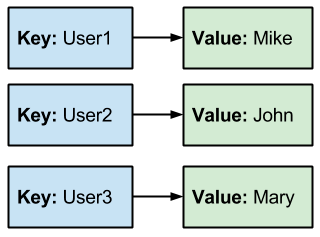

# Maps


* _Core Java: Volume I—Fundamentals_
  * 9.3


## Overview

Maps are associative arrays in which we can store key-value pairs. Keys, by definition, must be unique, and are used to retrieve values from the map.

## Implementations

We're going to focus on just one implementation of the `Map` interface: the `HashMap`.

### HashMap

A `HashMap` is, in some ways, like the `HashSet` we looked at earlier. You provide a key and a value, and those values are mapped to the keys. Value retrieval is also done via the provided key.

Creation and usage aren't all that dissimilar to other data structures we've gone over.

#### Constructors

There are four ways in which you can create a HashMap, but we're going to focus only on three of them.

* `HashMap()`
* `HashMap(int initialCapacity)`
* `HashMap(Map<? extends K, ? extends V> m)`

This is a good example that probably requires some investigating [the documentation](https://docs.oracle.com/en/java/javase/11/docs/api/java.base/java/util/HashMap.html). As a hint, `K` represents the key and `V` represents the value.

#### Methods

Maps support more operations than sets and queues, but not quite as many as lists.

* `clear()`
* `containsKey(Object key)`
* `containsValue(Object value)`
* `get(Object key)`
* `isEmpty()`
* `keySet()`
* `put(K key, V value)`
* `remove(Object key)`
* `size()`
* `values()`

Again, some of these might feel intuitive based on its name. Others, maybe not. That's why we have [the documentation](https://docs.oracle.com/en/java/javase/11/docs/api/java.base/java/util/HashMap.html), so use it!



