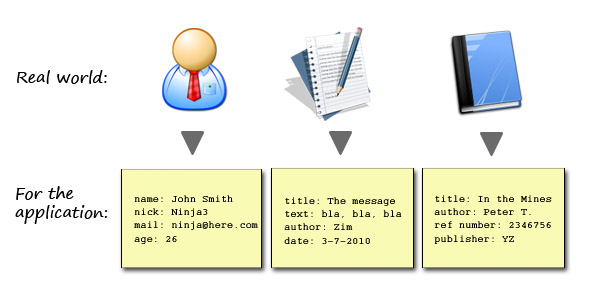

# Design Patterns


* \_\_[_A Beginner's Guide to MVC Architecture in Java_](https://www.upgrad.com/blog/mvc-architecture-in-java/)\_\_


## MVC

In software engineering, a design pattern is a reusable solution or strategy to a common problem or task. The Model-View-Controller \(or MVC\) design pattern is a solution to the common architectural challenge of creating multitiered applications. Normally, this is reference to web applications, but we'll get into those a little later in the course. In many ways, MVC is much more than a design pattern; it's an entire architectural framework around which you can build your applications.

## Model

The model is the core of any Java application. It is responsible for the data \(i.e., representing data as objects\) and the business logic. Consider of a common application we all know and love: PowerSchool. There are users \(students, teachers, administrators\), courses, assignments, and much more. All of these must be _modeled_ by our application, and this is done in the model, of course.

Any requests to view or modify data will be routed to the model, where those changes are made. Now, let's get into who's doing the routing and where those changes are reflected.

## View

We need a way to present all of the data in our model to the users of our application. That presentational layer is called the view. It's job is simple: render the data. It isn't concerned with the business logic or what the data means within the larger context of the application.

This division of labor is what makes the MVC architecture a useful strategy to create applications. Each component has a specific responsibility. As programmers, we can focus on making our views responsive and aesthetically pleasing, without having to worry about everything else. On larger software projects, there are often different developers \(or teams of developers\) responsible for frontend and backend tasks. The view would fall squarely as a frontend task, while the model is in the backend.

So, the model takes care of the data and the view shows it to the users. These two need to be in communication with each other, and that's where the controller comes in.

## Controller

The controller manages the application, and takes care of facilitating communication between the view and the model. Remember, requests come in from our users via actions they take in the view. This might be typing into a text box or clicking a button. These requests are routed by the controller to the appropriate method in the model, and the result is then transferred back to the view for rendering.

We're not yet working with a database, but that would be another layer in our application most closely connected to the model. Either way, the controller is the glue that keeps all the pieces together.

