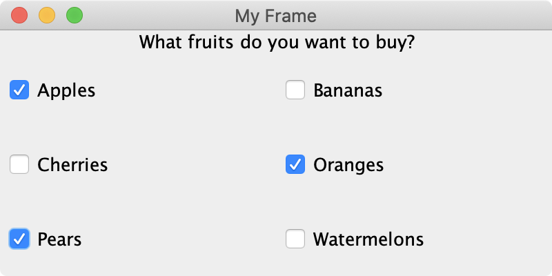
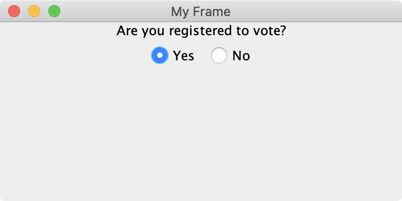

# Menus and Input


* _Core Java: Volume I—Fundamentals_
  * 10, 11, and 12
* _Core Java: Volume II—Advanced Features_
  * 10
* [Trail: Creating a GUI with JFC/Swing](https://docs.oracle.com/javase/tutorial/uiswing/index.html)


## User Interaction

We've taken a look at some limited examples of user interaction. There are many more things that a user can do in addition to clicking buttons and typing keys. We're going to dive into other forms of input, as well as some menu options.

## Checkboxes and Radio Buttons

A checkbox is probably pretty self-explanatory, but you may be little unsure of what a radio button is. Don't worry, they're pretty similar and we'll cover the important differences.

Suppose you want to provide a number of options, and allow the user to select one or more of them. This is a great opportunity to use checkboxes.

```java
import java.awt.BorderLayout;
import java.awt.GridLayout;

import javax.swing.JCheckBox;
import javax.swing.JFrame;
import javax.swing.JLabel;
import javax.swing.JPanel;
import javax.swing.SwingConstants;

public class FrameDemo {
    
    /**
     * Create and show the GUI.
     */
     
    public void createAndShowGui() {
        JFrame frame = new JFrame("My Frame");        
        JPanel panel = new JPanel();
        JLabel label = new JLabel(
            "What fruits do you want to buy?",
            SwingConstants.CENTER
        );
        
        // we're going to add all of our checkboxes to this
        // panel. we're using a layout manager to show the
        // checkboxes in a 3-by-3 grid.
        
        JPanel checkboxes = new JPanel(new GridLayout(3, 3));
        JCheckBox apples = new JCheckBox("Apples");
        JCheckBox bananas = new JCheckBox("Bananas");
        JCheckBox cherries = new JCheckBox("Cherries");
        JCheckBox oranges = new JCheckBox("Oranges");
        JCheckBox pears = new JCheckBox("Pears");
        JCheckBox watermelons = new JCheckBox("Watermelons");
        
        // add the checkboxes to the checkbox panel.
        
        checkboxes.add(apples);
        checkboxes.add(bananas);
        checkboxes.add(cherries);
        checkboxes.add(oranges);
        checkboxes.add(pears);
        checkboxes.add(watermelons);
        
        // set the parent panel layout manager, and add the
        // label and checkboxes.
        
        panel.setLayout(new BorderLayout());
        panel.add(label, BorderLayout.NORTH);
        panel.add(checkboxes, BorderLayout.CENTER);
        
        frame.add(panel);
        frame.setSize(400, 200);
        frame.setVisible(true);
    }
    
    public static void main(String[] args) {
        new FrameDemo().createAndShowGui();
    }
}

```

Here we have a `JLabel` and six `JCheckBoxes`. In a real application, selected a checkbox would do something. The focus here is showing you have to display these in a GUI. As always, I've commented my code \(though a little less thoroughly\). You should be picking up on the broad strokes by now. Here's what it would look like if we launched this application and selected a few options.



If, on the other hand, you want a user to select one option or the other, it might be better to use a radio button. It's possible to do this with checkboxes, but it's less intuitive to a user.

```java
import java.awt.BorderLayout;

import javax.swing.JFrame;
import javax.swing.JLabel;
import javax.swing.JPanel;
import javax.swing.JRadioButton;
import javax.swing.SwingConstants;

public class FrameDemo {
    
    /**
     * Create and show the GUI.
     */
     
    public void createAndShowGui() {
        JFrame frame = new JFrame("My Frame");        
        JPanel panel = new JPanel();
        JLabel label = new JLabel(
            "Are you registered to vote?",
            SwingConstants.CENTER
        );
        
        // we're going to add our radio buttons to their own panel.
        
        JPanel radios = new JPanel();
        JRadioButton yes = new JRadioButton("Yes");
        JRadioButton no = new JRadioButton("No");
        
        radios.add(yes);
        radios.add(no);
        
        // set parent panel layout manager, and add label and radio buttons.
        
        panel.setLayout(new BorderLayout());
        panel.add(label, BorderLayout.NORTH);
        panel.add(radios, BorderLayout.CENTER);
        
        frame.add(panel);
        frame.setSize(400, 200);
        frame.setVisible(true);
    }
    
    public static void main(String[] args) {
        new FrameDemo().createAndShowGui();
    }
}

```

Another simple example with a JLabel and two JRadioButtons. As I said, intuitively users expect to select only one radio button \(as opposed to checkboxes, which are more plural in nature\). Nevertheless, this functionality would need to be implemented. It doesn't work like this out-of-the-box. Here's what it would look like if we launched this application and selected `Yes`.



Alright, now you know everything there is to know about Swing and building GUIs, right? Let's dive into our first tutorial and project!

