# Heroku

## Summary

[Heroku](https://www.heroku.com/) is one of many Platform-as-a-Service \(PaaS\) options. As you've developed your last few web applications, the burden of hosting the application has fallen on you. Tomcat and MySQL were both running locally, which meant you were responsible for solving any infrastructure-related problems.

> Heroku is a cloud platform that lets companies build, deliver, monitor, and scale apps — we're the fastest way to go from idea to URL, bypassing all those infrastructure headaches.

There's a little upfront work to be done to integrate Heroku into your development and deployment processes, but I think you'll find it allows you to focus more of your energy on actually writing code.


This tutorial focuses almost entirely on the process by which you can deploy an application to Heroku. If you're looking for assistance in creating specific functionalities or features, there are other tutorials more suited to that purpose.


## Account Registration

If you don't already have a Heroku account \(and you probably don't\), you'll need to [quickly create one](https://signup.heroku.com/). It's completely free and all you'll need is an email. Consider using a personal email. Heroku confirmation emails often get suck in the district's email filters.

## Creating an App

Log into your newly created Heroku account, and click `Create new app`.

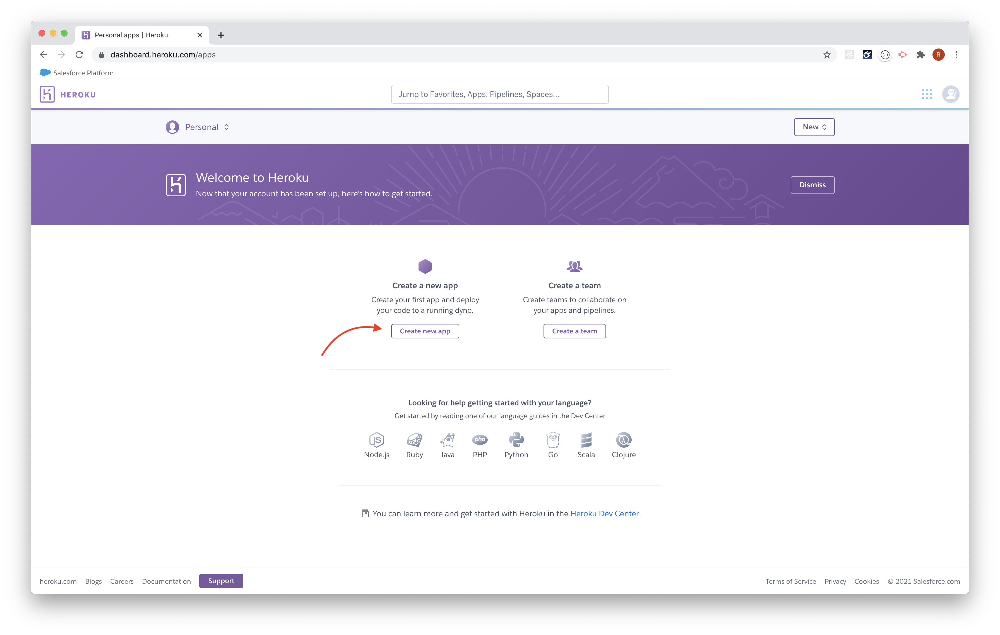

Give your app a unique name. Heroku uses a shared namespace, so common names are almost certainly taken. I chose `heroku-demo-ucvts`, which means you'll have to choose something different.

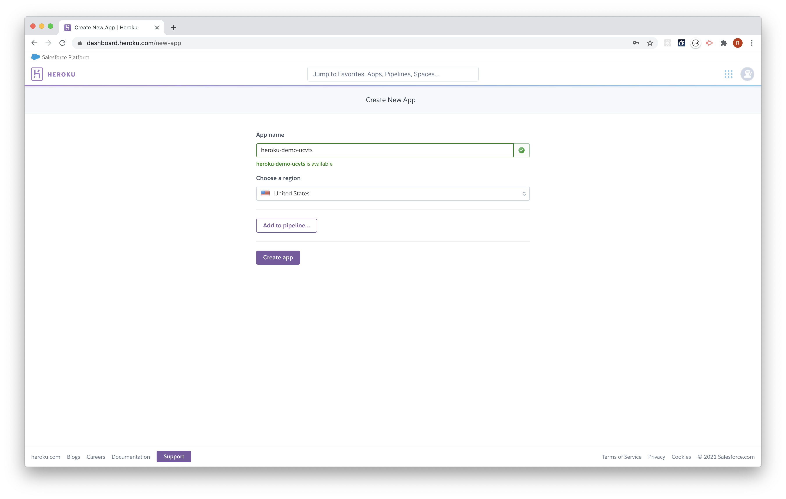

Click `Create app`. You can skip the deployment setup for now. It makes more sense to come back to this later.

### Adding a Buildpack

A buildpack is what gives developers to host apps across different languages and frameworks. Essentially, it provides the appropriate runtime environment for your code. You can add a buildpack from the `Settings` tab.

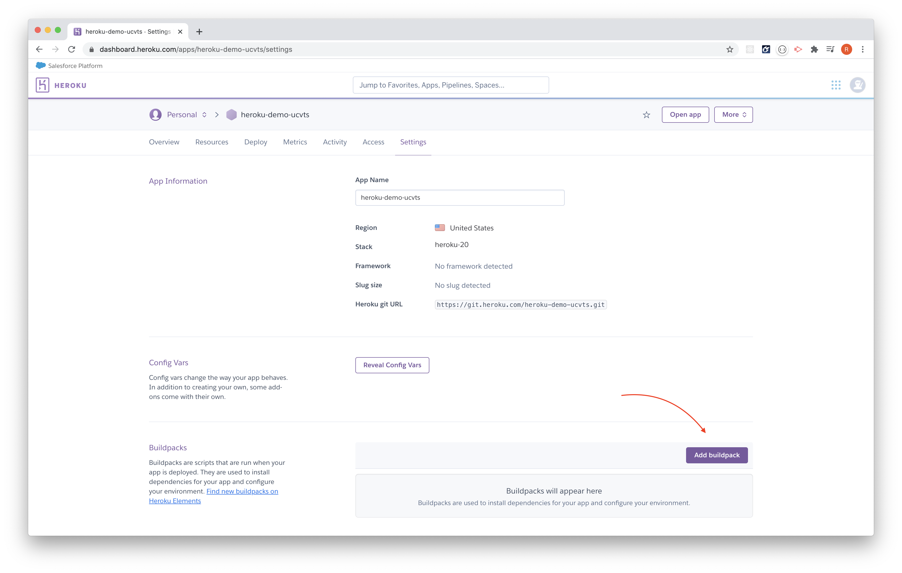

Select the officially supported `java` buildpack, and click `Save changes`. If you don't see the appropriate icon, you can just type `heroku/java` into the textfield.

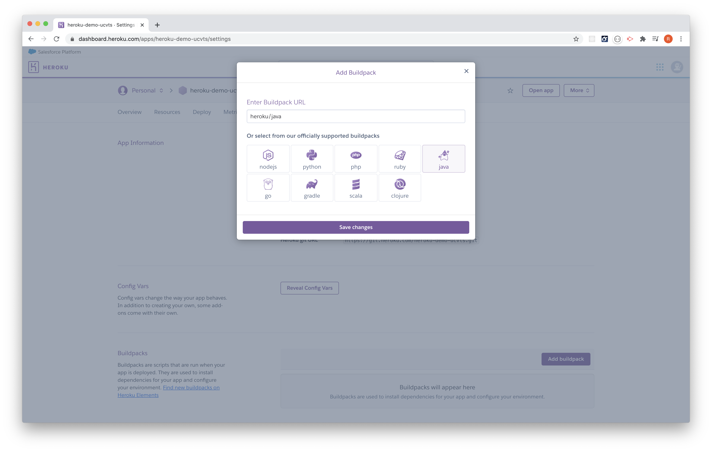

You'll see the buildpack added to your app, and it'll be used later when you're ready to deploy.

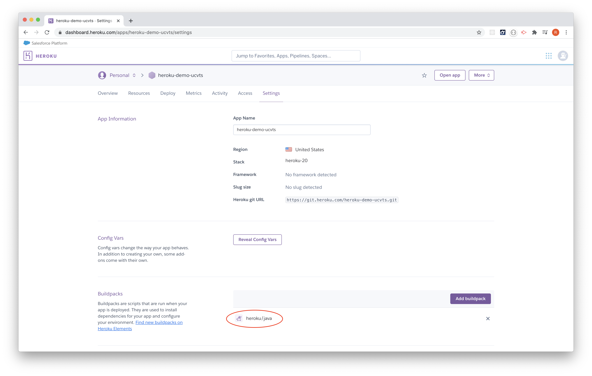

### Provisioning an Add-on

An add-on is a third-part component needed to support your app. Analytics, data storage, and monitoring are all examples of add-ons. You can attach these to your app in the `Resources` tab.

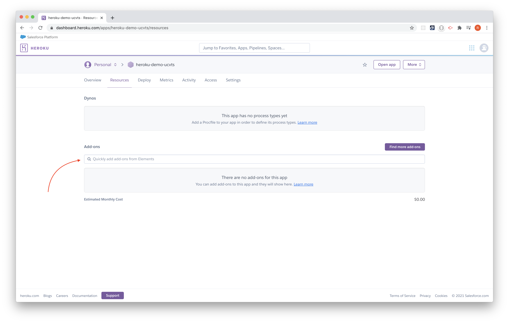

Type `Heroku Postgres` in the `Add-ons` textfield, and select the available option.

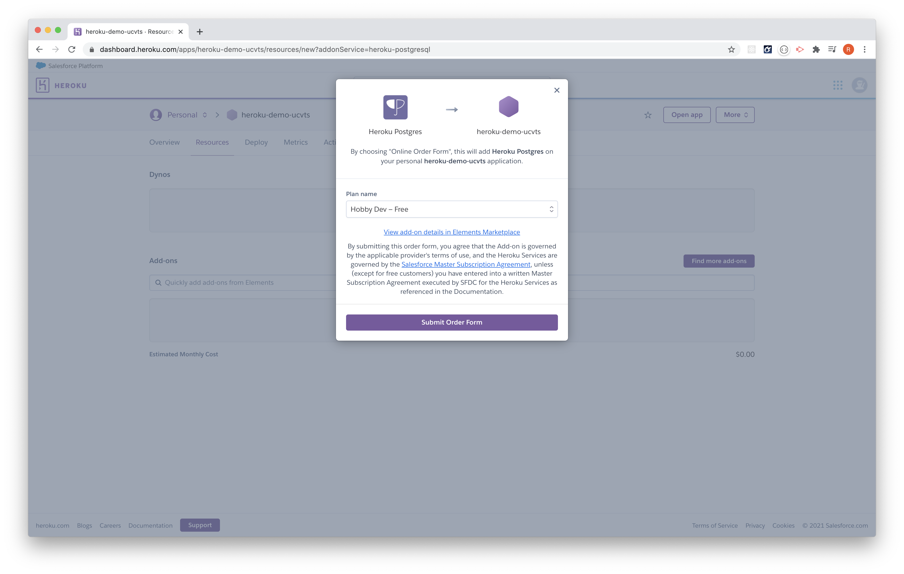

Click `Submit Order Form` to attach the PostgreSQL database to your app.

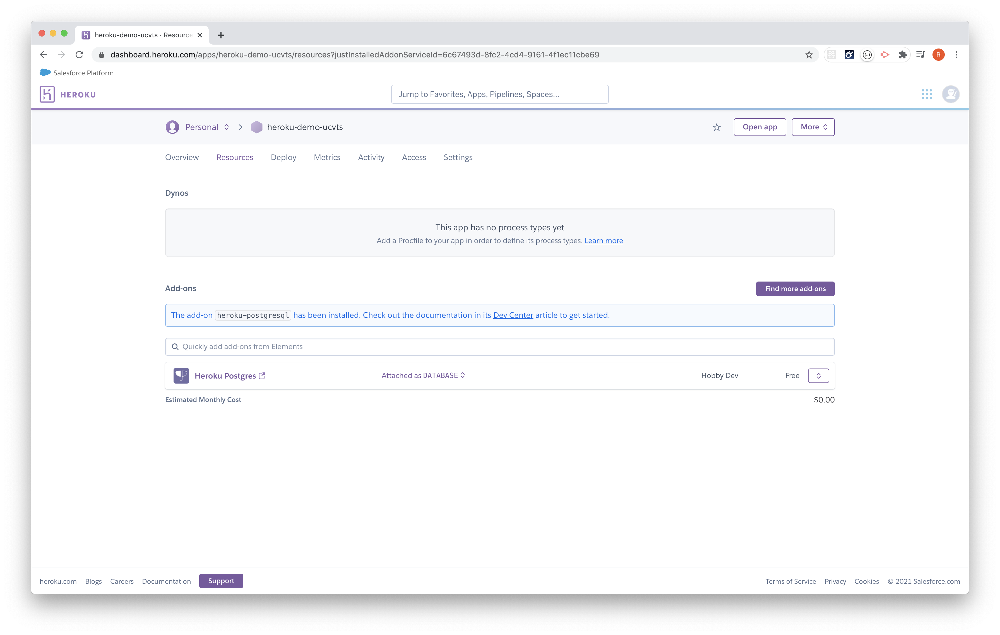

You're going to need the database connection details, which you can find these by clicking `Heroku Postgres`. It'll open in a separate browser tab; when it does, go to the `Settings` tab.

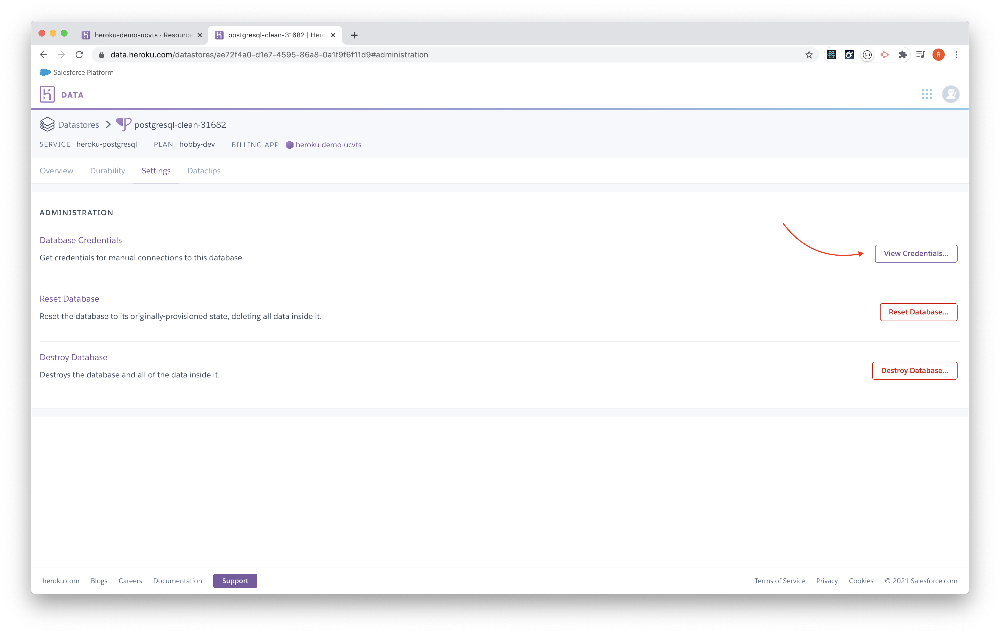

## Working with PostgreSQL

PostgreSQL is an open-source relational database option. There are some important differences when comparing it to MySQL, but it's similar enough for your purposes.

### pgAdmin

MySQL Workbench let you write SQL queries to execute against your database. [pgAdmin](https://www.pgadmin.org/download/) does the same thing for PostgreSQL. Download and install whichever one applies to your operating system.

The first thing you'll need to do when opening pgAdmin is set your master password. It's important you remember what this is.

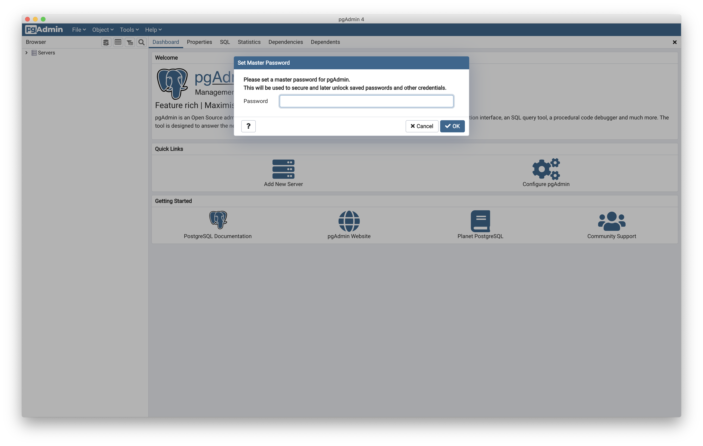

Click `Add New Server`. If your installation doesn't have this option, right-clicking `Servers` and navigating to `Create > Server...` will achieve the same result.

First things first, give your server a name. I used `heroku-demo-ucvts-db,` which is just my app name plus `-db`. I recommend you do something similar.

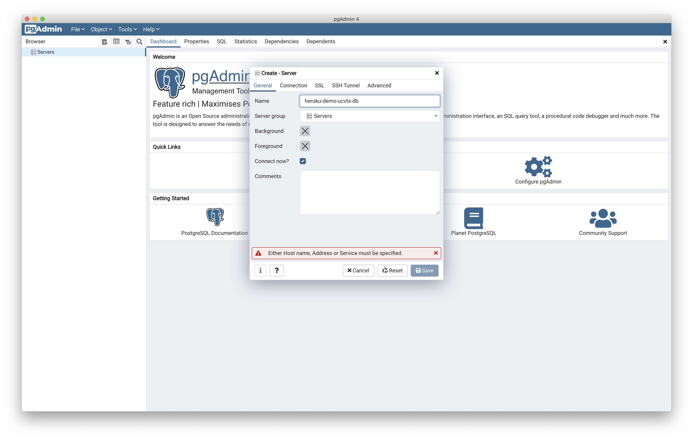

Next, go to the `Connection` tab. This is where you'll need those Postgres credentials from Heroku. I've entered some dummy values, but you'll need to replace them with your actual details.

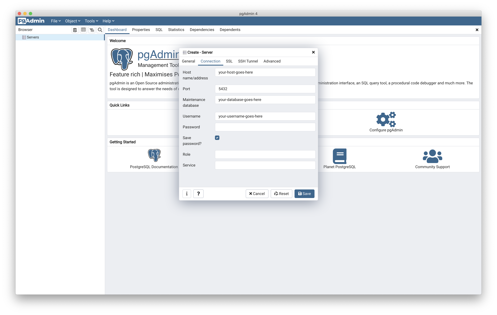

Copy and paste the connection details provided by Heroku.

| Heroku | pgAdmin |
| :--- | :--- |
| Host | Host name/address |
| Port | Port |
| Database | Maintenance database |
| User | Username |
| Password | Password |

Click `Save` when you're done. You'll be able to see your newly connected server, along with a ton of databases \(probably thousands\).

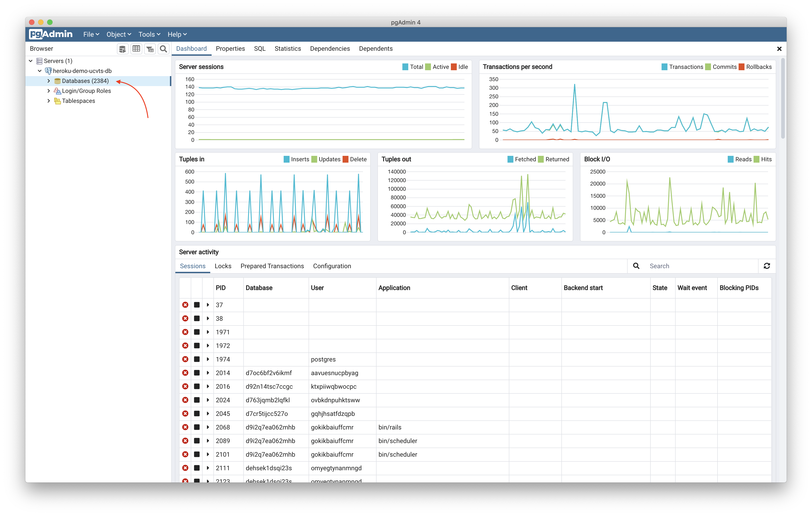

You're using a shared instance, so yours is just one of many databases hosted on this server.

### Sample Data

Right-click your database and click `Query Tool`.

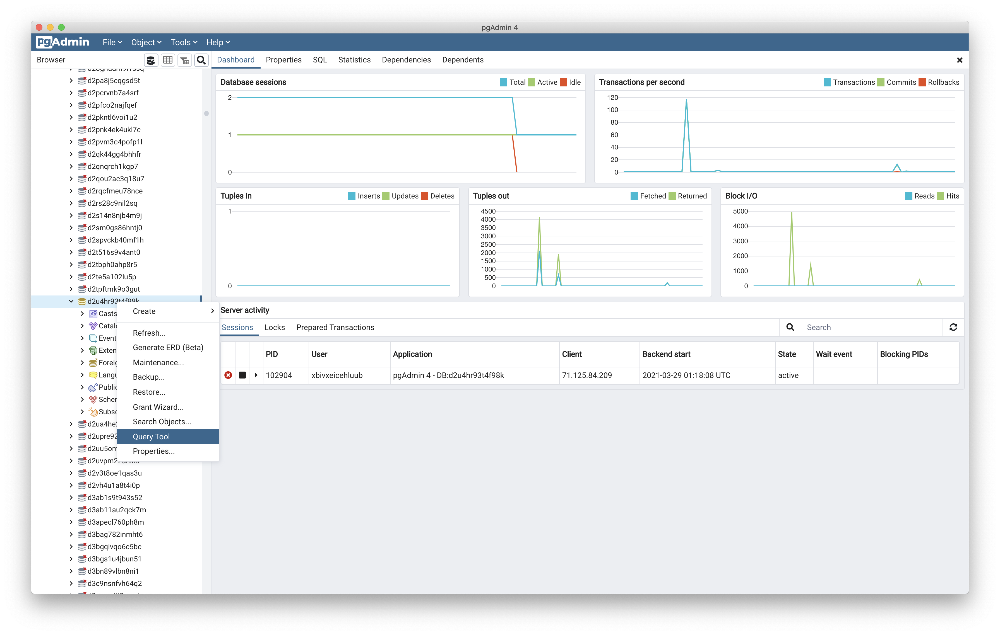

Enter the following SQL statements into the `Query Editor`, and execute them with the play button.

```sql
CREATE TABLE IF NOT EXISTS books (
  id SERIAL PRIMARY KEY,
  title VARCHAR,
  author VARCHAR
);

INSERT INTO books (title, author) VALUES ('In Search of Lost Time', 'Marcel Proust');
INSERT INTO books (title, author) VALUES ('Ulysses', 'James Joyce');
INSERT INTO books (title, author) VALUES ('Don Quixote', 'Miguel de Cervantes');
INSERT INTO books (title, author) VALUES ('The Great Gatsby', 'F. Scott Fitzgerald');
INSERT INTO books (title, author) VALUES ('One Hundred Years of Solitude', 'Gabriel Garcia Marquez');
```

`SERIAL` is equivalent to using `AUTO_INCREMENT` in MySQL. You can verify that the data has been successfully inserted by executing a `SELECT` statement.

```sql
SELECT * FROM books;
```

## Writing the Application Code

Now that you've created an app on Heroku and hooked up your database, you'll need to write the application code to make something minimally viable.

### Project Structure

Create a Dynamic Web Project in Eclipse, and convert it to a Maven Project. You can keep the default settings here, with one exception: set the packaging to `war`. Your `pom.xml` file will look a lot like the one's you've created in the past, with the addition of the `<build>` section.

```markup
<project
  xmlns="http://maven.apache.org/POM/4.0.0"
  xmlns:xsi="http://www.w3.org/2001/XMLSchema-instance"
  xsi:schemaLocation="http://maven.apache.org/POM/4.0.0 https://maven.apache.org/xsd/maven-4.0.0.xsd"
>
  <modelVersion>4.0.0</modelVersion>
  <groupId>heroku-demo-ucvts</groupId>
  <artifactId>heroku-demo-ucvts</artifactId>
  <version>0.0.1-SNAPSHOT</version>
  <packaging>war</packaging>
  <name>heroku-demo-ucvts</name>
  
  <dependencies>
    <dependency>
      <groupId>javax.servlet</groupId>
      <artifactId>javax.servlet-api</artifactId>
      <version>4.0.1</version>
      <scope>provided</scope>
    </dependency>
    <dependency>
      <groupId>javax.servlet.jsp</groupId>
      <artifactId>javax.servlet.jsp-api</artifactId>
      <version>2.3.3</version>
      <scope>provided</scope>
    </dependency>
    <dependency>
      <groupId>jstl</groupId>
      <artifactId>jstl</artifactId>
      <version>1.2</version>
    </dependency>
    <dependency>
      <groupId>org.postgresql</groupId>
      <artifactId>postgresql</artifactId>
      <version>42.2.1</version>
    </dependency>
  </dependencies>
  
  <build>
    <plugins>
      <plugin>
        <groupId>org.apache.maven.plugins</groupId>
        <artifactId>maven-dependency-plugin</artifactId>
        <version>3.0.2</version>
        <executions>
          <execution>
            <phase>package</phase>
            <goals>
              <goal>copy</goal>
            </goals>
            <configuration>
              <artifactItems>
                <artifactItem>
                  <groupId>com.github.jsimone</groupId>
                  <artifactId>webapp-runner</artifactId>
                  <version>8.5.31.0</version>
                  <destFileName>webapp-runner.jar</destFileName>
                </artifactItem>
              </artifactItems>
            </configuration>
          </execution>
        </executions>
      </plugin>
    </plugins>
  </build>
</project>
```

Next, create a `Procfile` \(without an extension\) in the root of your project with the following text.

```text
web: java $JAVA_OPTS -jar target/dependency/webapp-runner.jar --port $PORT target/*.war
```

TODO

## Deploying to Heroku

Back in Heroku, go to the `Deploy` tab and add GitHub as a deployment method.

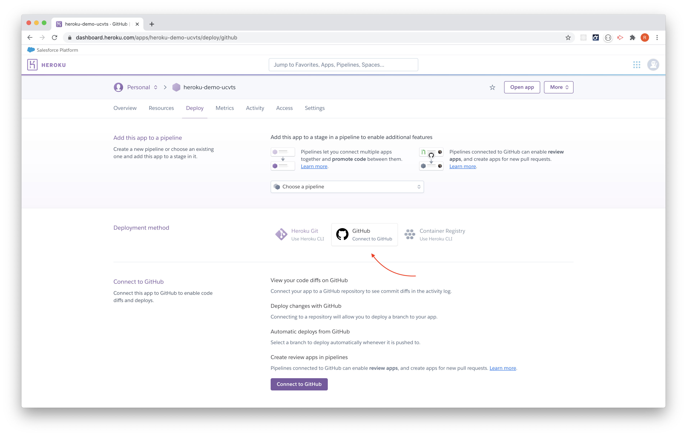

Click `Connect to GitHub`, and grant Heroku access to your repositories. Search for the repository you created earlier, and click `Connect`.

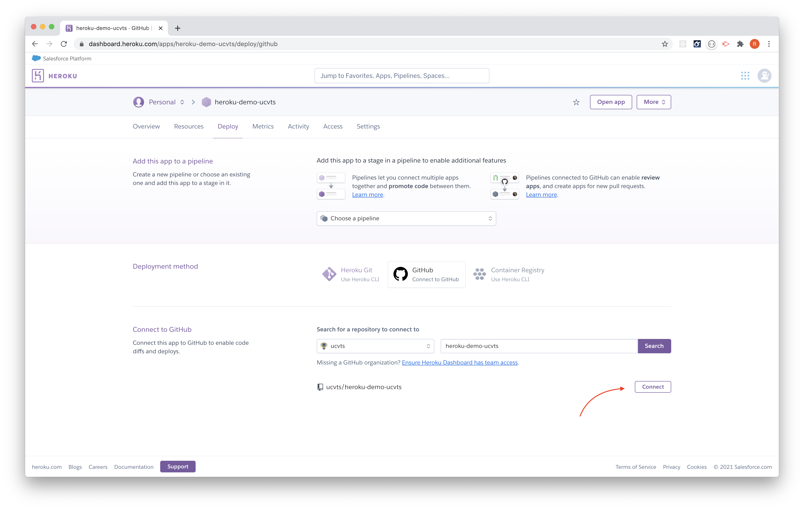

If you've pushed all of your application code to your repository, click `Deploy Branch`.

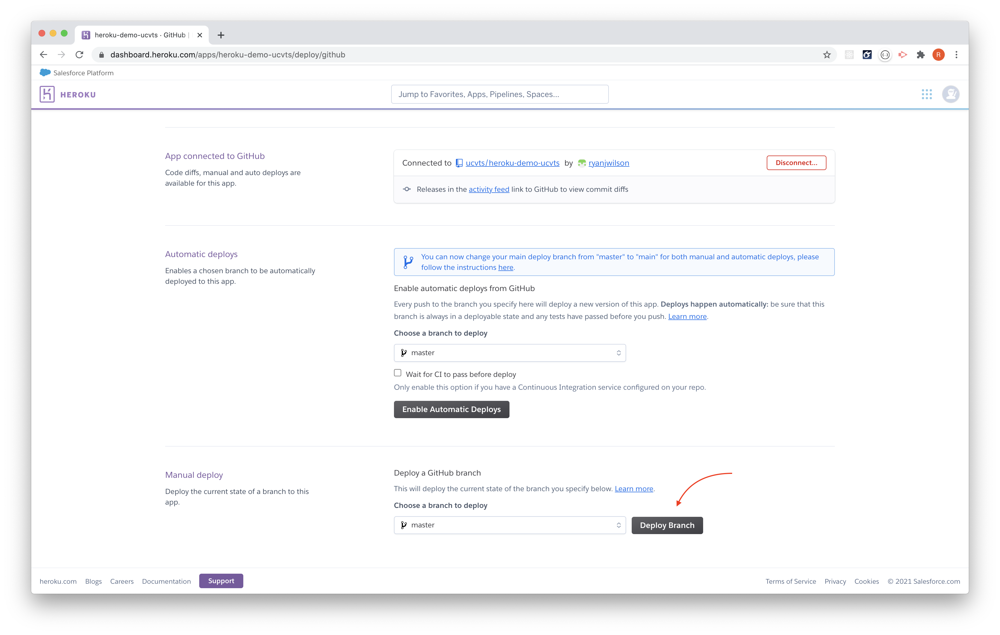

If you enable automatic deploys, then Heroku will trigger a build with each push to your repository. Basically, you won't have to manually click `Deploy Branch`. In some situations, this is incredibly useful. Other times, you may want to wait until you're ready to build.

